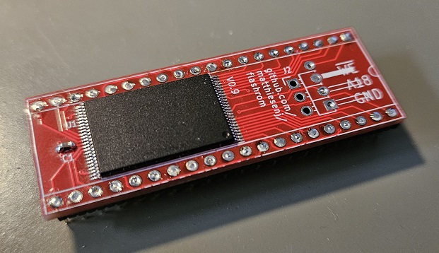
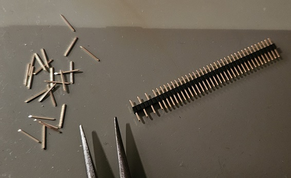

# Flashrom
The main purpose of this project is to implement a flashmemory-based kickstart ROM substitute/switcher for the Commodore Amiga line of computers.
It may also serve as a general-purpose substitute for 27C400-style EEPROMs.

It is based around the 29F800 1MB flash memory chip and is very close to the same dimensions as a 40 pin DIP socket, and low profile.

## Inspiration
There are some other projects out there which are similar to this one, and while I probably can't guarantee that there was no inspirational effects at all from these, all of the electrical design, schematics and PCB layouts in this project were done completely from scratch.

## Compatibility
I've only tested this with Amiga 4000 and Amiga 500, as it's all I have access to, but as the pinout matches 27C400 there's no reason it shouldn't work in other 5V systems using this pinout.
Jumpers provide compatibility with Amiga 500 rev 5 which has two ROM socket pins swapped (other revs affected?).

## Versatility

## Socket preservation
Dual-wipe DIP sockets will get damaged by inserting a regular pin strip with 0.6 x 0.6 mm square pins into it - or, it's actually when you need to insert a 40 pin DIP chip again, it will cause problems, because the wide pins of the pin strip bends the wipes so they don't spring back properly (a regular DIP chip has about 0.25mm wide pins).

This project is intended to use 1.27mm pin strips with every other pin removed. These can be found with 0.4 x 0.4mm (or slimmer) pins which won't damage the dual-wipe socket.
Because of this, the PCB holes for the pins are smaller to correctly align the strips while being soldered.

