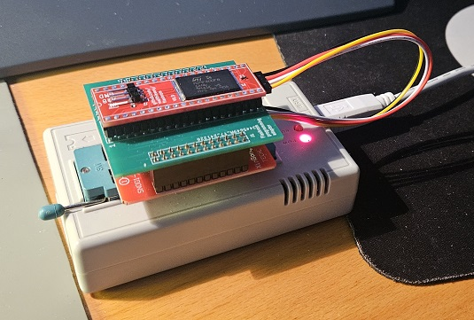

# TL866CS/A flash adapter for 29Fx00 flashrom project

This PCBA makes it possible to use a TL866CS/A programmer with the TSOP48/SOP44 adapter to program the 29Fx00 flashrom solution.
It's also useful for reading the contents of EPROMs and mask ROMs with a JEDEC pinout matching an Amiga ROM or 27Cx00 EPROM.

  

The design is very simple, it just reroutes the signals of the TSOP/SOP adapter to match the pinout of mentioned ROMs/EPROMs.
Only a few headers need to be soldered to the board, and the through holes for the main socket are Ø 1.0mm to be able to fit a Textool ZIF socket if so desired.
The 4-wire cable serves to connect the 4 missing signals on the 40-pin DIP interface required for programming (_WE, RY_BY, A18, and _RESET) to the programming adapter